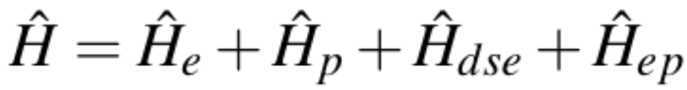
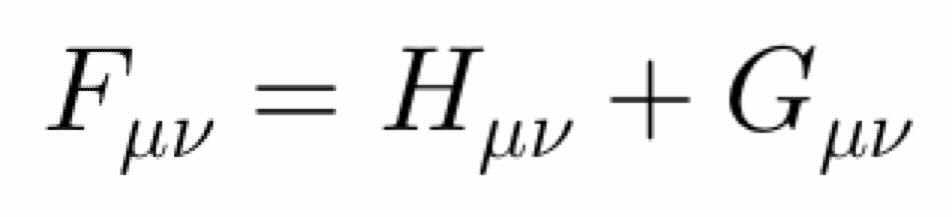
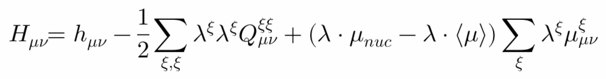
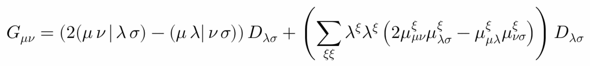
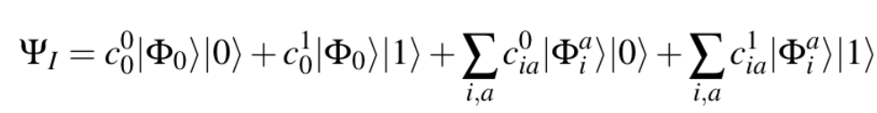
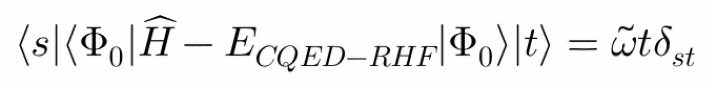
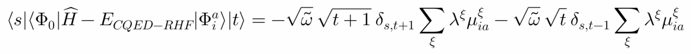
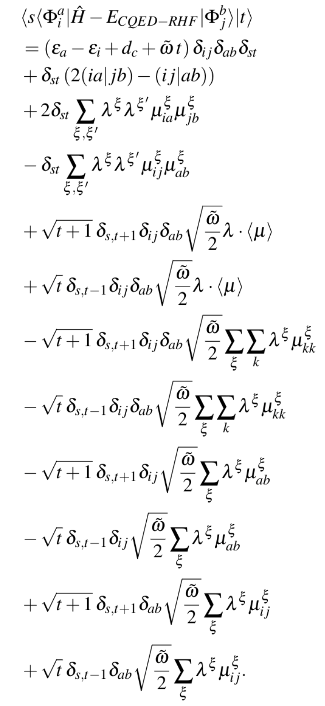

Polaritonic-Quantum-Chemistry
====================================

Psi4Numpy implementations of hybrid *ab initio* - cavity quantum electrodynamics methods for molecules strongly coupled to a single quantized photon mode.
These methods can be used for studying polaritonic chemical effects; relevant papers given in the **References** section.
The following codes are available:
- `CQED_RHF.py`: A script to compute a modified Restricted Hartree-Fock ground-state of the water molecule strongly coupled to a single photon.
- `CS_CQED_CIS.py`: A script to compute the ground-state and excitation energies of a lone MgH+ molecule (Case 1), MgH+ strongly 
                    coupled to a single photon that is resonant with the first dipole-allowed transition (Case 2), and
                    MgH+ coupled to a single photon with finite lifetime / complex energy with central energy resonant with the first dipole
                    allowed-transition (Case 3).

Helper programs:
- `helper_CQED_RHF.py`: A helper function to perform Restricted Hartree-Fock theory for the mean-field ground state of the  Pauli-Fierz Hamiltonian that includes an *ab initio* electronic Hamiltonian with dipolar coupling to a quantized photon mode and a quadratic self polarization energy contribution.  This implementation builds upon Psi4Numpy's [RHF.py](https://github.com/psi4/psi4numpy/blob/master/Self-Consistent-Field/RHF.py).
- `helper_CS_CQED_CIS.py`: A helper function to perform configuration interaction singles for the mean-field excited-states of the Pauli-Fierz Hamiltonian including an *ab initio* electronic Hamiltonian with dipolar coupling to a quantized photon mode and a quadratic self polarization energy contribution.

### Overview
We adopt a Pauli-Fierz Hamiltonian for the molecular system interacting with a quantized photon:



where the `H_e` term denotes the standard molecular electronic Hamiltonian within the Born-Oppenheimer approximation, `H_p` contains 
the energy of the photonic mode (which can be complex, to account for finite lifetime of the photonic mode), `H_dse` is a quadratic dipole self energy term, and 
`H_ep` is a bilinear coupling between the electronic and photonic degrees of freedom within the dipole approximation.

At the heart of CQED-RHF is an augmented Fock operator `F` that includes dipolar and quadrupolar coupling between 
the molecular electronic and photonic degrees of freedom that arise specifically from `H_dse` above:



Where the Core Hamiltonian `H` is defined as follows:



and the 2-electron contributions `G` are augmented as follows



The helper_CQED_RHF.py function will build this augmented Fock matrix and use it the SCF procedue.  Note that the
dipole terms in the augmented core Hamiltonian are scaled by the dipole moment expectation value, which depends on the
CQED-RHF orbitals; hence the core Hamiltonian is updated in the SCF steps.

To function within helper_CQED_RHF.py is `cqed_rhf()` and takes vector specifying the electric
field coupled to the molecule, a string that specifies the molecular geometry, and a dictionary containing psi4 options.  A dictionary
containing the CQED-RHF energy and related quantities is returned.

```python
cqed_rhf_dictionary = cqed_rhf([0., 0., 1e-2], '''\nMg\nH 1 1.7\nsymmetry c1\n1 1\n''', psi4_options_dictionary)
```

The returned dictionary contains the following keys:

```python

   'RHF ENERGY' -> result of canonical RHF calculation using psi4 defined by molecule_string and psi4_options_dict
   'CQED-RHF ENERGY' -> result of CQED-RHF calculation, see Eq. (13) of [McTague:2021:ChemRxiv]
   'CQED-RHF C' -> orbitals resulting from CQED-RHF calculation
   'CQED-RHF DENSITY MATRIX' -> density matrix resulting from CQED-RHF calculation
   'CQED-RHF EPS'  -> orbital energies from CQED-RHF calculation
   'PSI4 WFN' -> wavefunction object from psi4 canonical RHF calcluation
   'CQED-RHF DIPOLE MOMENT' -> total dipole moment from CQED-RHF calculation (1x3 numpy array)
   'NUCLEAR DIPOLE MOMENT' -> nuclear dipole moment (1x3 numpy array)
   'DIPOLE ENERGY' -> See Eq. (14) of [McTague:2021:ChemRxiv]
   'NUCLEAR REPULSION ENERGY' -> Total nuclear repulsion energy
```

The CS-CQED-CIS method builds and diagonalizes the Hamiltonian matrix `H_CQED_CIS` in the space of all singly excited electronic and photonic configurations,



where the photonic state `|0>` and `|1>` represent 0 or one photon occupied; note generic occupation number is denoted `|s>` and `|t>` below.
Here the electronic contributions have been transformed to the coherent state basis, i.e. the orbital basis that results from solving the
CQED-RHF equations.  There are three blocks to this Hamiltonian:



Which couples the reference electronic states and the photon occupation states through the photonic Hamiltonian,:



which coupled the reference electronic state to singly-excited electronic states and unnoccupied and occupied photonic states
through the electron-photon interaction Hamiltonian



which couples singly excited electronic states on the bra and the ket between all combinations of unoccupied and occupied photonic
states on the bra and the ket.

The function within helper_CS_CQED_RHF.py is `cs_cqed_cis()` and takes vector specifying the electric
field coupled to the molecule, a (real or complex) freqency associated with the photon, a string that specifies the molecular geometry, and a dictionary containing psi4 options.  A dictionary
containing the CS-CQED-CIS energy, left eigenvectors, and related quantities is returned

```python
cqed_cis_dictionary = cs_cqed_cis([0., 0., 1e-2], 0.1-0.01j, '''\nMg\nH 1 1.7\nsymmetry c1\n1 1\n''', psi4_options_dictionary)
```

The returned dictionary contains the following keys:

```python

    'RHF ENERGY' -> result of canonical RHF calculation using psi4 defined by molecule_string and psi4_options_dict
    'CQED-RHF ENERGY' -> result of CQED-RHF calculation, see Eq. (13) of [McTague:2021:ChemRxiv]
    'CQED-CIS ENERGY' -> numpy array of complex floats comprising energy eigenvalues of CQED-CIS Hamiltonian
    'CQED-CIS L VECTORS' -> numpy array of complex floats comprising the left eigenvectors of CQED-CIS Hamiltonian

```


### References

1. Pauli-Fierz Hamiltonian and CQED-RHF Equations
    - [[Haugland:2020:041043](https://journals.aps.org/prx/pdf/10.1103/PhysRevX.10.041043)] T. S. Haughland, E. Ronco, E. F. Kjonstad, A. Rubio, H. Koch, *Phys. Rev. X*, **10**, 041043 (2020) 
    - [[DePrince:2021:094112]](https://aip.scitation.org/doi/10.1063/5.0038748) A. E. DePrince III, *J. Chem. Phys.* **154**, 094113 (2021).
2. Detailed CQED-RHF and CQED-CIS equations and overview of algorithm   
    - [[McTague:2021:ChemRxiv](https://chemrxiv.org/engage/chemrxiv/article-details/611fa8d08a6faa13229c8be6)] J. McTague, J. J. Foley IV, *ChemRxiv*, 
doi: 10.33774/chemrxiv-2021-0gpz8 (2021)
