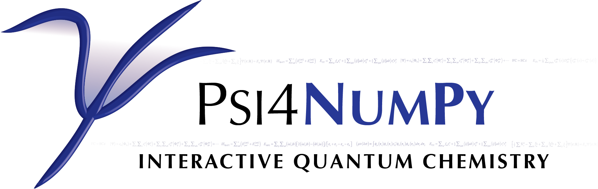

[](https://zenodo.org/badge/latestdoi/22622192)

=============

#####Overview

The overall goal of the Psi4NumPy project is to provide an interactive quantum chemistry
framework for reference implementations, rapid prototyping, development, and education.
To do this, quantities relevant to quantum chemistry are computed with the <span 'font-variant: 
small-caps'> Psi4 </span> electronic structure package, and subsequently manipulated 
using the Numerical Python (NumPy) package.  This combination
provides an interface that is both simple to use and remains relatively fast
to execute. 

A series of short scripts demonstrating the implementation of Hartree-Fock Self-Consistent 
Field, SCF Response, Møller-Plesset Perturbation Theory, Symmetry-Adapted Perturbation Theory, 
Coupled Cluster Theory, and more are provided for the reference of the quantum chemistry
community at large to facilitate both reproducibility and low-level methodological understanding.
Additionally, the Tutorials folder above represents an interactive educational
environment containing modules discussing the theory and implementation of various
quantum and computational chemistry methods.  By leveraging the popular Jupyter Notebook
application, each tutorial is constructed as hybrid theory and programming in an easy to use
interactive environment, removing the gap between theory and implementation.

If you have comments, questions, or would like to contribute to the project
please feel free to email [me](mailto:dgasmith@gatech.edu).

#####Getting Started
To begin using Psi4NumPy:
- Obtain recent versions of Psi4, NumPy, and SciPy (see Requirements for version details)
- Locate the `Psi4_install/lib` directory and execute the following:
```export PYTHONPATH=Psi4_install/lib```

All scripts should then be run as conventional Python scripts, `python -c "import Psi4"`.

A tutorial that covers the basics of NumPy can be found
[here](http://wiki.scipy.org/Tentative_NumPy_Tutorial).

#####Requirements:

- [Psi4](https://github.com/Psi4/Psi4) 1.1+
- [Python](python.org) 2.7+
 - [NumPy](scipy.org) 1.7.2+
 - [Scipy](numpy.scipy.org) 0.13.0+

#####Psi4 v1.1
This repostitory has recently been updated to be compatible with Psi4 version 1.1.
Please see the `v1.0` branch for a Psi4 v1.0 compliant Psi4NumPy version. 
