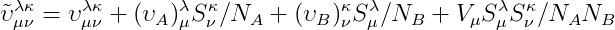

Symmetry-Adapted-Perturbation-Theory
====================================

The following codes are available:
- `SAPT0.py`: A simple Psi 4 input script to compute SAPT interaction energies.
- `SAPT0_ROHF.py`: A SAPT0(ROHF) script for the oxygen dimer (two triplets making a quintet).
- `SAPT0_no_S2.py`: A script to compute the SAPT0 interaction energy without the the Single-Exchange Approximation.
- `SAPT0ao.py`: A Psi 4 input script to compute SAPT interaction energies in atomic orbitals.

Helper programs:
- `helper_SAPT.py`: A collection of helper classes and functions for SAPT.

The most important operator in SAPT is the intermolecular interaction operator `\tilde{V}`, that is defined as follows:



As all SAPT quantities will make use of this expression, a SAPT helper object that can automatically build this value greatly simplifies many routine SAPT tasks. In psi4numpy this helper object can be initialized as follow:

```python
sapt = helper_SAPT(dimer, memory=8)
```

Where the dimer object is a Psi4 Molecule with exactly two fragments.

Indices used:
- a - occupied indices of monomer A
- b - occupied indices of monomer B
- r - virtual indices of monomer A
- s - virtual indices of monomer B

The `sapt` object now contains all of the information that we need to compute the following:
- `v`: Two electron repulsion integrals in the MO basis (e.g. `sapt.v('arar')`)
- `s`: Overlap integrals in the MO basis (e.g. `sapt.s('ab')`)
- `eps`: SCF eigenvalues (e.g. `sapt.eps('a')`)
- `potential`: Electrostatic potential of a monomer (e.g. `sapt.potential('bb', 'A')`)
- `vt`: Intermolecular interaction operator \tilde{V} (e.g. `sapt.vt('arar')`)
- `chf`: Computes CPHF orbitals for each monomer (e.g. `chf('A')`)

Where for all 4-index quantities the order of the indices is as follows:

`\tilde{V}_{0, 1}^{2, 3}`

For example, the expression for first order electrostatics is as follows:

`4 * \tilde{V}_{a, b}^{a, b}`

Computation of the \tilde{V} operator can be accomplished as:

`vt_abab = sapt.vt('abab')`

`vt_abab` is a 4-index tensor that needs to be summed over following einsum convention:

`Elst10 = 4 * np.einsum('abab', vt_abab)`

By first building a tool to compute arbitrary `\tilde{V}` tensors we can, in principle, compute up to third order SAPT easily.

### References

1. General SAPT Theory & SAPT0 Equations
    - [[Szalewicz:2005:43](https://www.springer.com/us/book/9783540281917)] K. Szalewicz, K. Patkowski, and B. Jeziorski, in Intermolecular Forces and Clusters II (Springer Berlin Heidelberg, Berlin/Heidelberg, 2005), pp. 43–117.
    - [[Jeziorski:1994:1887]](https://pubs.acs.org/doi/abs/10.1021/cr00031a008) B.  Jeziorski,  R.  Moszynski,  and  K.  Szalewicz, *Chem. Rev.* **94**, 1887 (1994).  
    - [[Szalewicz:2012:254](http://wires.wiley.com/WileyCDA/WiresArticle/wisId-WCMS86.html)] K. Szalewicz, *WIREs: Comput. Mol. Sci.* **2**, 254 (2012).  
    - [[Hohenstein:2012:304](https://onlinelibrary.wiley.com/doi/abs/10.1002/wcms.84)] E. G. Hohenstein and C. D. Sherrill, *WIREs: Comput. Mol. Sci.* **2**, 304 (2012).
2. SAPT0 without the Single-Exchange approximation:
    - [[Jeziorski:1976:281](https://onlinelibrary.wiley.com/doi/pdf/10.1002/qua.560100208)] B. Jeziorski *et al.* *Int. J. Quantum Chem.* **10**, 281 (1976)
    - [[Schaffer:2012:1235](https://link.springer.com/article/10.1007/s00214-012-1235-6)] R. Schaffer *et al.* *Theor. Chem. Acc.* **131**, 1235 (2012)
    - [[Schaffer:2013:2570](https://www.tandfonline.com/doi/abs/10.1080/00268976.2013.827253)] R. Schaffer *et al.* *Mol. Phys.* **111**, 2570 (2013)
2. SAPT(ROHF) for multiplet splittings:
    - [[Patkowski:2018:164110](https://aip.scitation.org/doi/10.1063/1.5021891?af=R)] K. Patkowski, P. S. Zuchowski, and D. G. A. Smith, *J. Chem. Phys.* **148**, 164110 (2018)

